# Klauro Platform - Critical Flow Paths (Visual)

**Version:** 1.0
**Last Updated:** 2026-01-24

This document provides visual flowcharts for all critical user journeys through the Klauro platform.

---

## 1. Authentication Flows

### 1.1 New User Registration

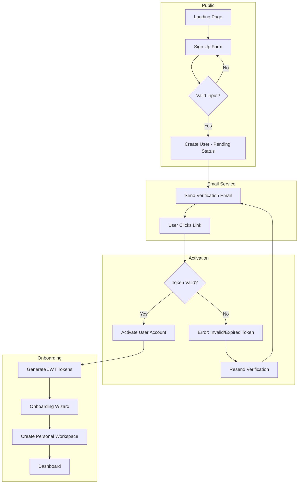
```mermaid
flowchart TD
    subgraph Public
        A[Landing Page] --> B[Sign Up Form]
        B --> C{Valid Input?}
        C -->|No| B
        C -->|Yes| D[Create User - Pending Status]
    end

    subgraph Email Service
        D --> E[Send Verification Email]
        E --> F[User Clicks Link]
    end

    subgraph Activation
        F --> G{Token Valid?}
        G -->|No| H[Error: Invalid/Expired Token]
        H --> I[Resend Verification]
        I --> E
        G -->|Yes| J[Activate User Account]
    end

    subgraph Onboarding
        J --> K[Generate JWT Tokens]
        K --> L[Onboarding Wizard]
        L --> M[Create Personal Workspace]
        M --> N[Dashboard]
    end
```

### 1.2 User Login Flow

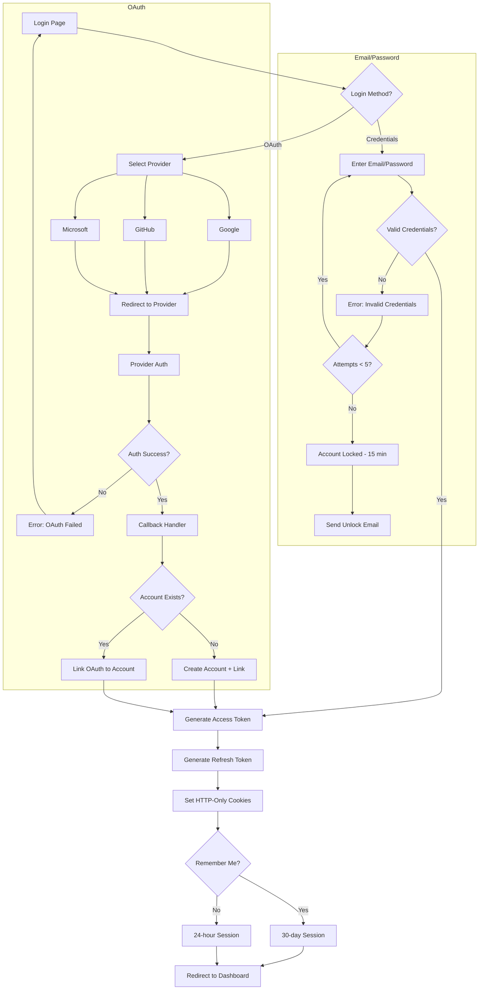
```mermaid
flowchart TD
    A[Login Page] --> B{Login Method?}

    subgraph Email/Password
        B -->|Credentials| C[Enter Email/Password]
        C --> D{Valid Credentials?}
        D -->|No| E[Error: Invalid Credentials]
        E --> F{Attempts < 5?}
        F -->|Yes| C
        F -->|No| G[Account Locked - 15 min]
        G --> H[Send Unlock Email]
    end

    subgraph OAuth
        B -->|OAuth| I[Select Provider]
        I --> J[Google]
        I --> K[GitHub]
        I --> L[Microsoft]
        J & K & L --> M[Redirect to Provider]
        M --> N[Provider Auth]
        N --> O{Auth Success?}
        O -->|No| P[Error: OAuth Failed]
        P --> A
        O -->|Yes| Q[Callback Handler]
        Q --> R{Account Exists?}
        R -->|No| S[Create Account + Link]
        R -->|Yes| T[Link OAuth to Account]
    end

    D -->|Yes| U[Generate Access Token]
    S --> U
    T --> U
    U --> V[Generate Refresh Token]
    V --> W[Set HTTP-Only Cookies]
    W --> X{Remember Me?}
    X -->|Yes| Y[30-day Session]
    X -->|No| Z[24-hour Session]
    Y & Z --> AA[Redirect to Dashboard]
```

### 1.3 Token Refresh Flow

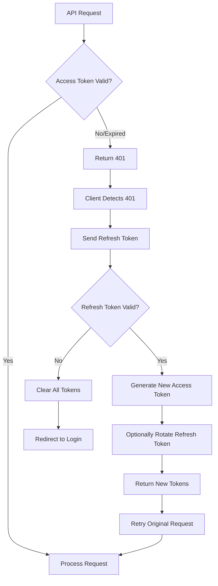
```mermaid
flowchart TD
    A[API Request] --> B{Access Token Valid?}
    B -->|Yes| C[Process Request]
    B -->|No/Expired| D[Return 401]
    D --> E[Client Detects 401]
    E --> F[Send Refresh Token]
    F --> G{Refresh Token Valid?}
    G -->|No| H[Clear All Tokens]
    H --> I[Redirect to Login]
    G -->|Yes| J[Generate New Access Token]
    J --> K[Optionally Rotate Refresh Token]
    K --> L[Return New Tokens]
    L --> M[Retry Original Request]
    M --> C
```

### 1.4 Password Reset Flow

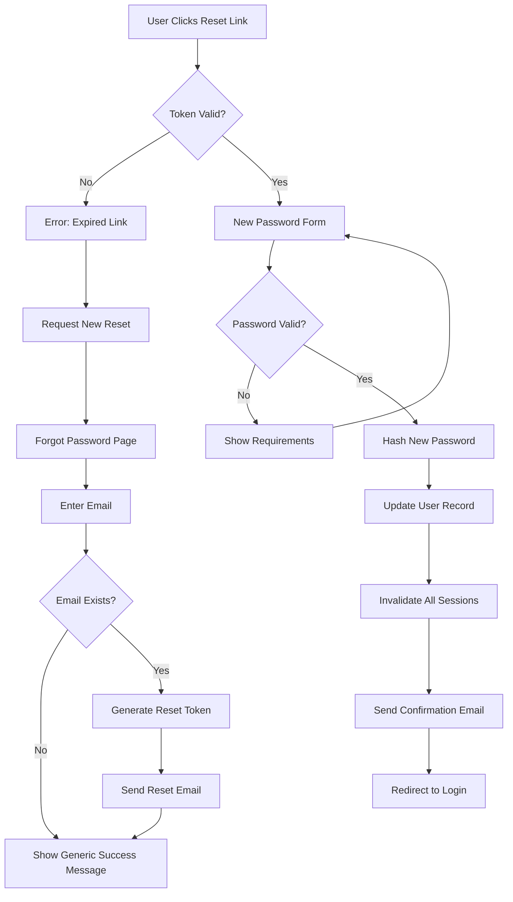
```mermaid
flowchart TD
    A[Forgot Password Page] --> B[Enter Email]
    B --> C{Email Exists?}
    C -->|No| D[Show Generic Success Message]
    C -->|Yes| E[Generate Reset Token]
    E --> F[Send Reset Email]
    F --> D

    G[User Clicks Reset Link] --> H{Token Valid?}
    H -->|No| I[Error: Expired Link]
    I --> J[Request New Reset]
    J --> A
    H -->|Yes| K[New Password Form]
    K --> L{Password Valid?}
    L -->|No| M[Show Requirements]
    M --> K
    L -->|Yes| N[Hash New Password]
    N --> O[Update User Record]
    O --> P[Invalidate All Sessions]
    P --> Q[Send Confirmation Email]
    Q --> R[Redirect to Login]
```

---

## 2. Workspace Management Flows

### 2.1 Workspace Creation

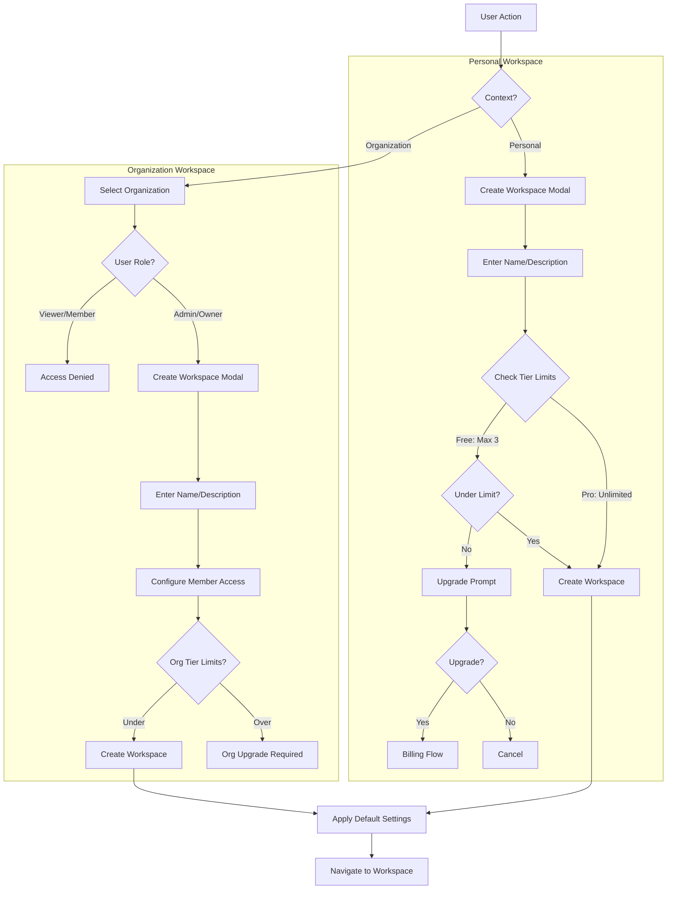
```mermaid
flowchart TD
    A[User Action] --> B{Context?}

    subgraph Personal Workspace
        B -->|Personal| C[Create Workspace Modal]
        C --> D[Enter Name/Description]
        D --> E{Check Tier Limits}
        E -->|Free: Max 3| F{Under Limit?}
        E -->|Pro: Unlimited| G[Create Workspace]
        F -->|No| H[Upgrade Prompt]
        H --> I{Upgrade?}
        I -->|Yes| J[Billing Flow]
        I -->|No| K[Cancel]
        F -->|Yes| G
    end

    subgraph Organization Workspace
        B -->|Organization| L[Select Organization]
        L --> M{User Role?}
        M -->|Viewer/Member| N[Access Denied]
        M -->|Admin/Owner| O[Create Workspace Modal]
        O --> P[Enter Name/Description]
        P --> Q[Configure Member Access]
        Q --> R{Org Tier Limits?}
        R -->|Under| S[Create Workspace]
        R -->|Over| T[Org Upgrade Required]
    end

    G --> U[Apply Default Settings]
    S --> U
    U --> V[Navigate to Workspace]
```

### 2.2 Workspace Access Control

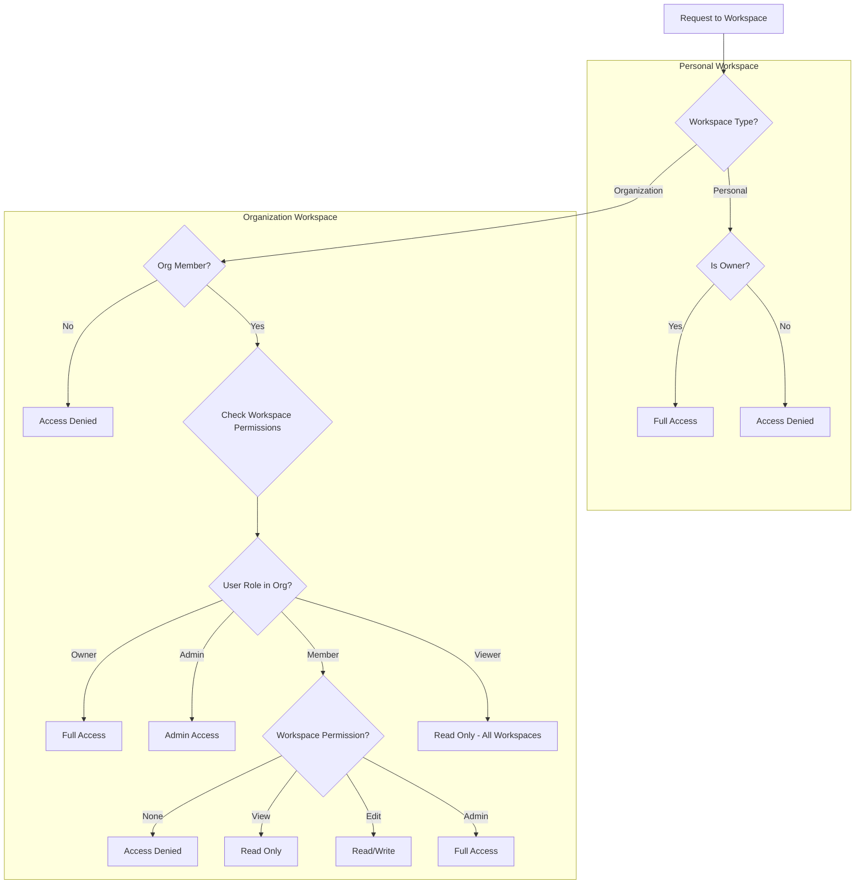
```mermaid
flowchart TD
    A[Request to Workspace] --> B{Workspace Type?}

    subgraph Personal Workspace
        B -->|Personal| C{Is Owner?}
        C -->|Yes| D[Full Access]
        C -->|No| E[Access Denied]
    end

    subgraph Organization Workspace
        B -->|Organization| F{Org Member?}
        F -->|No| G[Access Denied]
        F -->|Yes| H{Check Workspace Permissions}
        H --> I{User Role in Org?}
        I -->|Owner| J[Full Access]
        I -->|Admin| K[Admin Access]
        I -->|Member| L{Workspace Permission?}
        L -->|None| M[Access Denied]
        L -->|View| N[Read Only]
        L -->|Edit| O[Read/Write]
        L -->|Admin| P[Full Access]
        I -->|Viewer| Q[Read Only - All Workspaces]
    end
```

### 2.3 Workspace Lifecycle

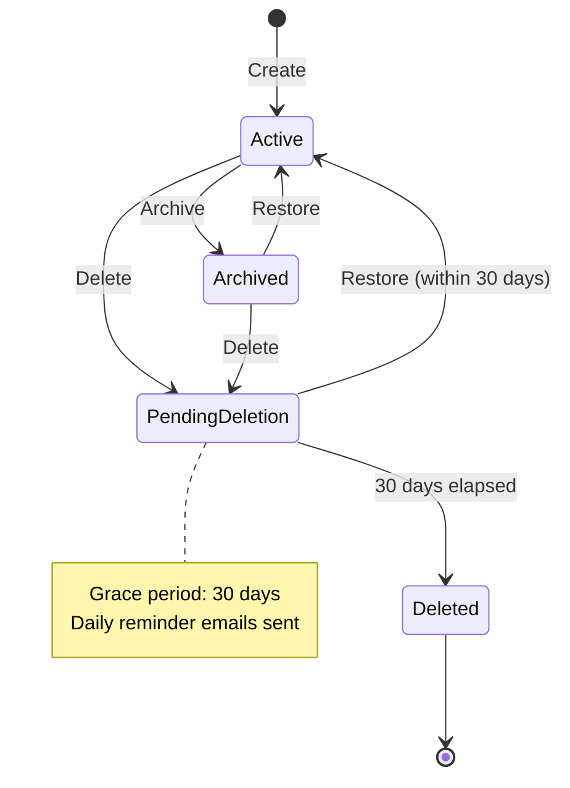
```mermaid
stateDiagram-v2
    [*] --> Active: Create
    Active --> Archived: Archive
    Archived --> Active: Restore
    Active --> PendingDeletion: Delete
    Archived --> PendingDeletion: Delete
    PendingDeletion --> Active: Restore (within 30 days)
    PendingDeletion --> Deleted: 30 days elapsed
    Deleted --> [*]

    note right of PendingDeletion
        Grace period: 30 days
        Daily reminder emails sent
    end note
```

---

## 3. Codebase Analysis Flows

### 3.1 Add Codebase Flow

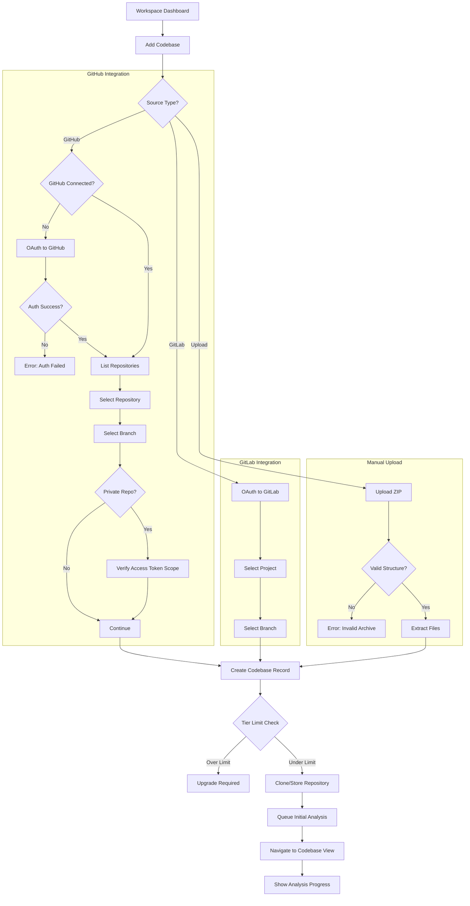
```mermaid
flowchart TD
    A[Workspace Dashboard] --> B[Add Codebase]
    B --> C{Source Type?}

    subgraph GitHub Integration
        C -->|GitHub| D{GitHub Connected?}
        D -->|No| E[OAuth to GitHub]
        E --> F{Auth Success?}
        F -->|No| G[Error: Auth Failed]
        F -->|Yes| H[List Repositories]
        D -->|Yes| H
        H --> I[Select Repository]
        I --> J[Select Branch]
        J --> K{Private Repo?}
        K -->|Yes| L[Verify Access Token Scope]
        K -->|No| M[Continue]
        L --> M
    end

    subgraph GitLab Integration
        C -->|GitLab| N[OAuth to GitLab]
        N --> O[Select Project]
        O --> P[Select Branch]
    end

    subgraph Manual Upload
        C -->|Upload| Q[Upload ZIP]
        Q --> R{Valid Structure?}
        R -->|No| S[Error: Invalid Archive]
        R -->|Yes| T[Extract Files]
    end

    M & P & T --> U[Create Codebase Record]
    U --> V{Tier Limit Check}
    V -->|Over Limit| W[Upgrade Required]
    V -->|Under Limit| X[Clone/Store Repository]
    X --> Y[Queue Initial Analysis]
    Y --> Z[Navigate to Codebase View]
    Z --> AA[Show Analysis Progress]
```

### 3.2 Analysis Execution Pipeline

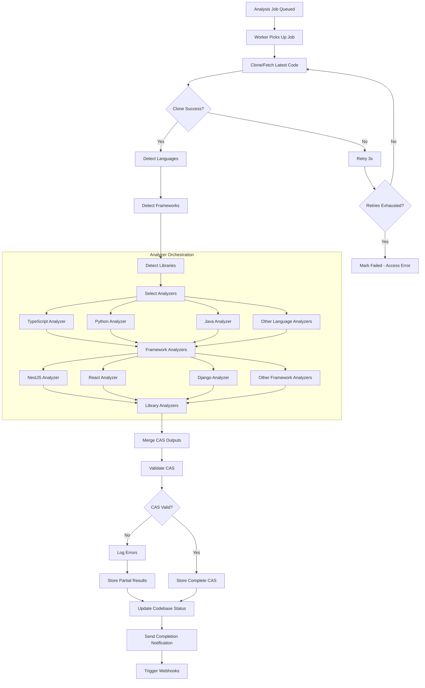
```mermaid
flowchart TD
    A[Analysis Job Queued] --> B[Worker Picks Up Job]
    B --> C[Clone/Fetch Latest Code]
    C --> D{Clone Success?}
    D -->|No| E[Retry 3x]
    E --> F{Retries Exhausted?}
    F -->|Yes| G[Mark Failed - Access Error]
    F -->|No| C

    D -->|Yes| H[Detect Languages]
    H --> I[Detect Frameworks]
    I --> J[Detect Libraries]

    subgraph Analyzer Orchestration
        J --> K[Select Analyzers]
        K --> L[TypeScript Analyzer]
        K --> M[Python Analyzer]
        K --> N[Java Analyzer]
        K --> O[Other Language Analyzers]

        L & M & N & O --> P[Framework Analyzers]
        P --> Q[NestJS Analyzer]
        P --> R[React Analyzer]
        P --> S[Django Analyzer]
        P --> T[Other Framework Analyzers]

        Q & R & S & T --> U[Library Analyzers]
    end

    U --> V[Merge CAS Outputs]
    V --> W[Validate CAS]
    W --> X{CAS Valid?}
    X -->|No| Y[Log Errors]
    Y --> Z[Store Partial Results]
    X -->|Yes| AA[Store Complete CAS]

    Z & AA --> AB[Update Codebase Status]
    AB --> AC[Send Completion Notification]
    AC --> AD[Trigger Webhooks]
```

### 3.3 Analysis States

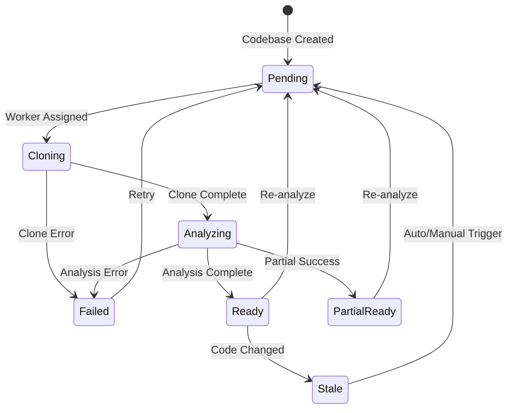
```mermaid
stateDiagram-v2
    [*] --> Pending: Codebase Created
    Pending --> Cloning: Worker Assigned
    Cloning --> Analyzing: Clone Complete
    Cloning --> Failed: Clone Error
    Analyzing --> Ready: Analysis Complete
    Analyzing --> PartialReady: Partial Success
    Analyzing --> Failed: Analysis Error
    Failed --> Pending: Retry
    PartialReady --> Pending: Re-analyze
    Ready --> Pending: Re-analyze
    Ready --> Stale: Code Changed
    Stale --> Pending: Auto/Manual Trigger
```

### 3.4 Webhook-Triggered Analysis

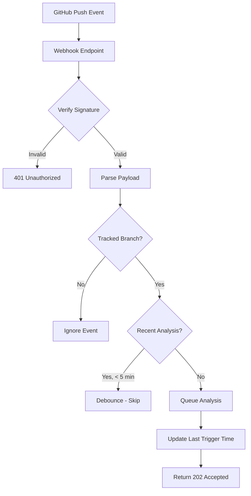
```mermaid
flowchart TD
    A[GitHub Push Event] --> B[Webhook Endpoint]
    B --> C{Verify Signature}
    C -->|Invalid| D[401 Unauthorized]
    C -->|Valid| E[Parse Payload]
    E --> F{Tracked Branch?}
    F -->|No| G[Ignore Event]
    F -->|Yes| H{Recent Analysis?}
    H -->|Yes, < 5 min| I[Debounce - Skip]
    H -->|No| J[Queue Analysis]
    J --> K[Update Last Trigger Time]
    K --> L[Return 202 Accepted]
```

---

## 4. Visualization & Navigation Flows

### 4.1 Progressive Disclosure Navigation

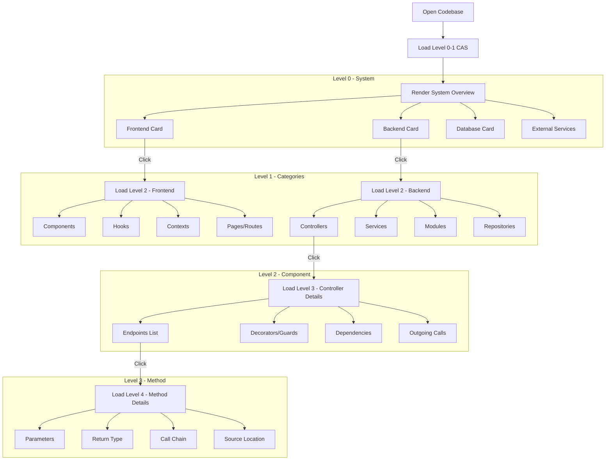
```mermaid
flowchart TD
    A[Open Codebase] --> B[Load Level 0-1 CAS]
    B --> C[Render System Overview]

    subgraph Level 0 - System
        C --> D[Frontend Card]
        C --> E[Backend Card]
        C --> F[Database Card]
        C --> G[External Services]
    end

    D -->|Click| H[Load Level 2 - Frontend]
    E -->|Click| I[Load Level 2 - Backend]

    subgraph Level 1 - Categories
        H --> J[Components]
        H --> K[Hooks]
        H --> L[Contexts]
        H --> M[Pages/Routes]

        I --> N[Controllers]
        I --> O[Services]
        I --> P[Modules]
        I --> Q[Repositories]
    end

    N -->|Click| R[Load Level 3 - Controller Details]

    subgraph Level 2 - Component
        R --> S[Endpoints List]
        R --> T[Decorators/Guards]
        R --> U[Dependencies]
        R --> V[Outgoing Calls]
    end

    S -->|Click| W[Load Level 4 - Method Details]

    subgraph Level 3 - Method
        W --> X[Parameters]
        W --> Y[Return Type]
        W --> Z[Call Chain]
        W --> AA[Source Location]
    end
```

### 4.2 Entry Point Exploration

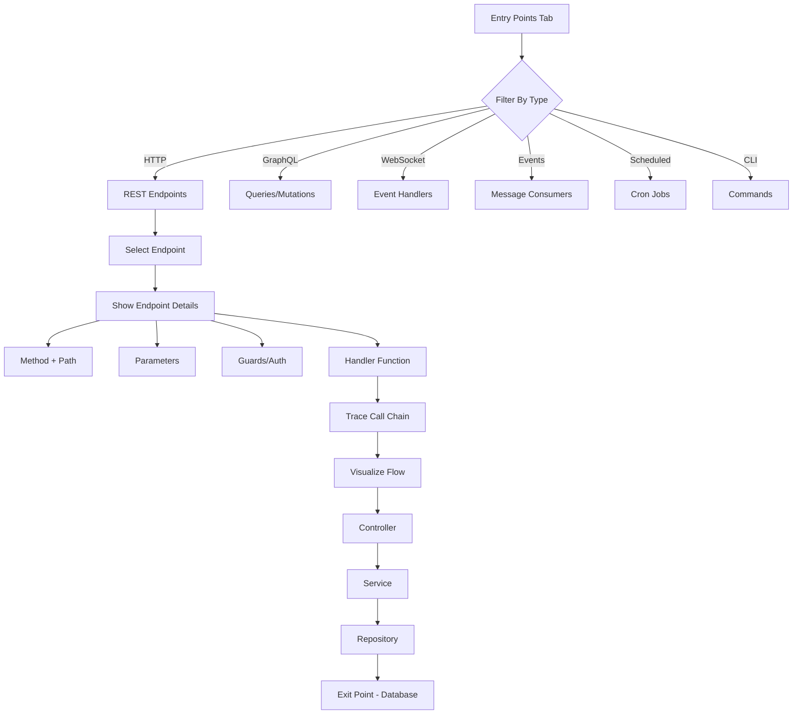
```mermaid
flowchart TD
    A[Entry Points Tab] --> B{Filter By Type}

    B -->|HTTP| C[REST Endpoints]
    B -->|GraphQL| D[Queries/Mutations]
    B -->|WebSocket| E[Event Handlers]
    B -->|Events| F[Message Consumers]
    B -->|Scheduled| G[Cron Jobs]
    B -->|CLI| H[Commands]

    C --> I[Select Endpoint]
    I --> J[Show Endpoint Details]
    J --> K[Method + Path]
    J --> L[Parameters]
    J --> M[Guards/Auth]
    J --> N[Handler Function]

    N --> O[Trace Call Chain]
    O --> P[Visualize Flow]
    P --> Q[Controller]
    Q --> R[Service]
    R --> S[Repository]
    S --> T[Exit Point - Database]
```

### 4.3 Search Flow

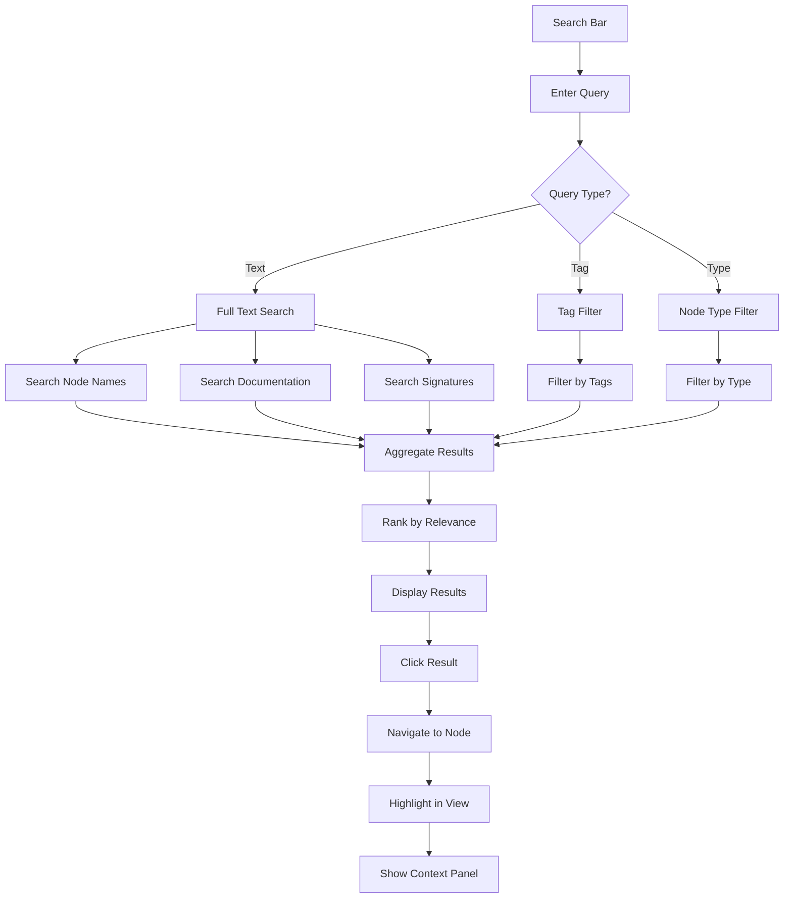
```mermaid
flowchart TD
    A[Search Bar] --> B[Enter Query]
    B --> C{Query Type?}

    C -->|Text| D[Full Text Search]
    C -->|Tag| E[Tag Filter]
    C -->|Type| F[Node Type Filter]

    D --> G[Search Node Names]
    D --> H[Search Documentation]
    D --> I[Search Signatures]

    E --> J[Filter by Tags]
    F --> K[Filter by Type]

    G & H & I & J & K --> L[Aggregate Results]
    L --> M[Rank by Relevance]
    M --> N[Display Results]

    N --> O[Click Result]
    O --> P[Navigate to Node]
    P --> Q[Highlight in View]
    Q --> R[Show Context Panel]
```

---

## 5. Organization & Team Flows

### 5.1 Organization Creation & Setup

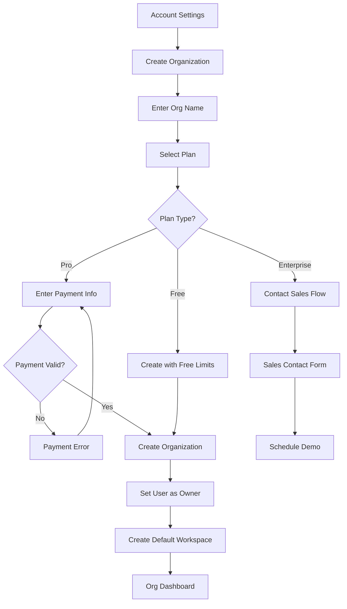
```mermaid
flowchart TD
    A[Account Settings] --> B[Create Organization]
    B --> C[Enter Org Name]
    C --> D[Select Plan]
    D --> E{Plan Type?}

    E -->|Free| F[Create with Free Limits]
    E -->|Pro| G[Enter Payment Info]
    E -->|Enterprise| H[Contact Sales Flow]

    G --> I{Payment Valid?}
    I -->|No| J[Payment Error]
    J --> G
    I -->|Yes| K[Create Organization]
    F --> K

    K --> L[Set User as Owner]
    L --> M[Create Default Workspace]
    M --> N[Org Dashboard]

    H --> O[Sales Contact Form]
    O --> P[Schedule Demo]
```

### 5.2 Member Invitation Flow

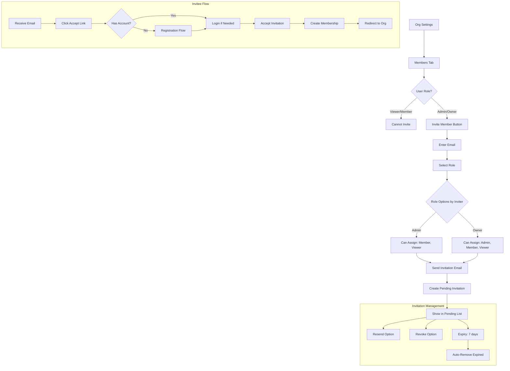
```mermaid
flowchart TD
    A[Org Settings] --> B[Members Tab]
    B --> C{User Role?}
    C -->|Viewer/Member| D[Cannot Invite]
    C -->|Admin/Owner| E[Invite Member Button]

    E --> F[Enter Email]
    F --> G[Select Role]
    G --> H{Role Options by Inviter}
    H -->|Admin| I[Can Assign: Member, Viewer]
    H -->|Owner| J[Can Assign: Admin, Member, Viewer]

    I & J --> K[Send Invitation Email]
    K --> L[Create Pending Invitation]
    L --> M[Show in Pending List]

    subgraph Invitee Flow
        N[Receive Email] --> O[Click Accept Link]
        O --> P{Has Account?}
        P -->|No| Q[Registration Flow]
        P -->|Yes| R[Login if Needed]
        Q --> R
        R --> S[Accept Invitation]
        S --> T[Create Membership]
        T --> U[Redirect to Org]
    end

    subgraph Invitation Management
        M --> V[Resend Option]
        M --> W[Revoke Option]
        M --> X[Expiry: 7 days]
        X --> Y[Auto-Remove Expired]
    end
```

### 5.3 Role Permissions Matrix

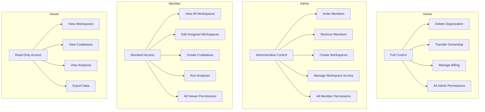
```mermaid
flowchart TD
    subgraph Owner
        A[Full Control]
        A --> A1[Delete Organization]
        A --> A2[Transfer Ownership]
        A --> A3[Manage Billing]
        A --> A4[All Admin Permissions]
    end

    subgraph Admin
        B[Administrative Control]
        B --> B1[Invite Members]
        B --> B2[Remove Members]
        B --> B3[Create Workspaces]
        B --> B4[Manage Workspace Access]
        B --> B5[All Member Permissions]
    end

    subgraph Member
        C[Standard Access]
        C --> C1[View All Workspaces]
        C --> C2[Edit Assigned Workspaces]
        C --> C3[Create Codebases]
        C --> C4[Run Analyses]
        C --> C5[All Viewer Permissions]
    end

    subgraph Viewer
        D[Read-Only Access]
        D --> D1[View Workspaces]
        D --> D2[View Codebases]
        D --> D3[View Analyses]
        D --> D4[Export Data]
    end
```

---

## 6. Billing & Subscription Flows

### 6.1 Subscription Upgrade

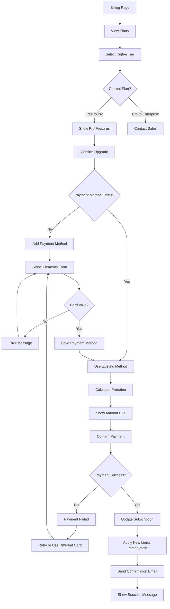
```mermaid
flowchart TD
    A[Billing Page] --> B[View Plans]
    B --> C[Select Higher Tier]
    C --> D{Current Plan?}

    D -->|Free to Pro| E[Show Pro Features]
    D -->|Pro to Enterprise| F[Contact Sales]

    E --> G[Confirm Upgrade]
    G --> H{Payment Method Exists?}
    H -->|No| I[Add Payment Method]
    H -->|Yes| J[Use Existing Method]

    I --> K[Stripe Elements Form]
    K --> L{Card Valid?}
    L -->|No| M[Error Message]
    M --> K
    L -->|Yes| N[Save Payment Method]
    N --> J

    J --> O[Calculate Proration]
    O --> P[Show Amount Due]
    P --> Q[Confirm Payment]
    Q --> R{Payment Success?}
    R -->|No| S[Payment Failed]
    S --> T[Retry or Use Different Card]
    T --> K
    R -->|Yes| U[Update Subscription]
    U --> V[Apply New Limits Immediately]
    V --> W[Send Confirmation Email]
    W --> X[Show Success Message]
```

### 6.2 Subscription Downgrade

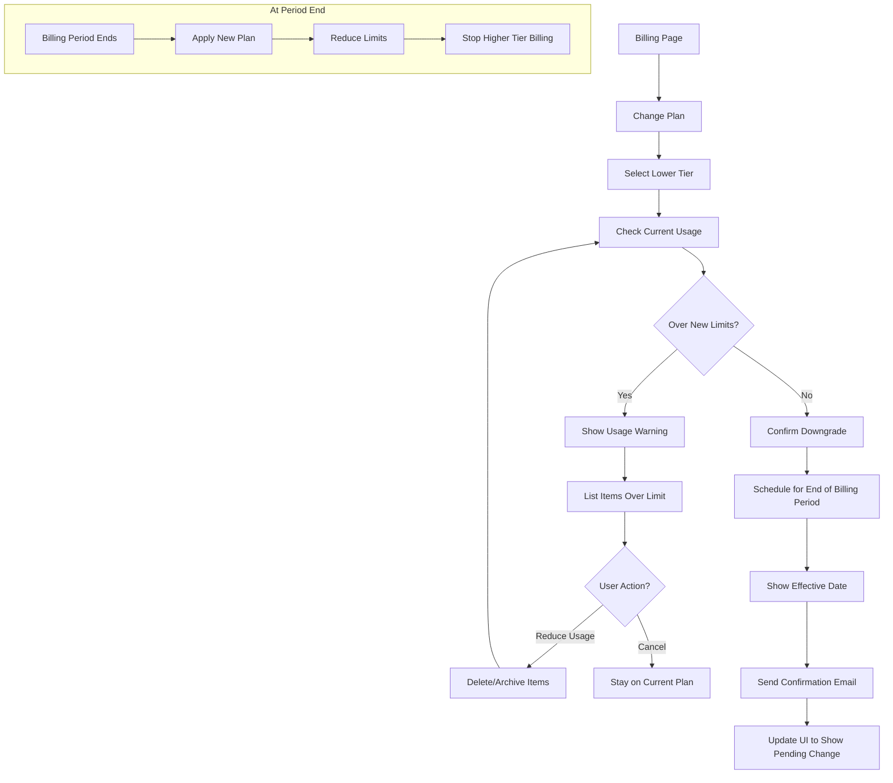
```mermaid
flowchart TD
    A[Billing Page] --> B[Change Plan]
    B --> C[Select Lower Tier]
    C --> D[Check Current Usage]

    D --> E{Over New Limits?}
    E -->|Yes| F[Show Usage Warning]
    F --> G[List Items Over Limit]
    G --> H{User Action?}
    H -->|Reduce Usage| I[Delete/Archive Items]
    I --> D
    H -->|Cancel| J[Stay on Current Plan]

    E -->|No| K[Confirm Downgrade]
    K --> L[Schedule for End of Billing Period]
    L --> M[Show Effective Date]
    M --> N[Send Confirmation Email]
    N --> O[Update UI to Show Pending Change]

    subgraph At Period End
        P[Billing Period Ends] --> Q[Apply New Plan]
        Q --> R[Reduce Limits]
        R --> S[Stop Higher Tier Billing]
    end
```

### 6.3 Subscription States

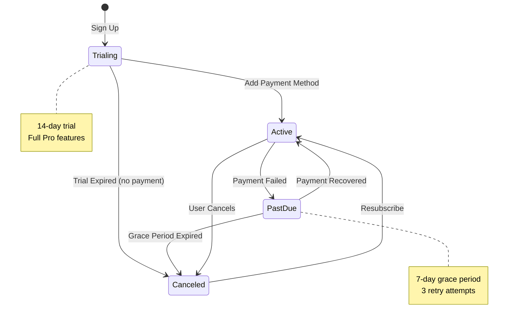
```mermaid
stateDiagram-v2
    [*] --> Trialing: Sign Up
    Trialing --> Active: Add Payment Method
    Trialing --> Canceled: Trial Expired (no payment)
    Active --> PastDue: Payment Failed
    PastDue --> Active: Payment Recovered
    PastDue --> Canceled: Grace Period Expired
    Active --> Canceled: User Cancels
    Canceled --> Active: Resubscribe

    note right of Trialing
        14-day trial
        Full Pro features
    end note

    note right of PastDue
        7-day grace period
        3 retry attempts
    end note
```

---

## 7. MCP Integration Flows

### 7.1 MCP Authentication & Query Flow

```mermaid
flowchart TD
    A[AI Tool - Claude Code/Cursor] --> B[Connect to MCP Server]
    B --> C[Authenticate with API Key]
    C --> D{Valid Key?}
    D -->|No| E[401 Unauthorized]
    D -->|Yes| F[Establish Session]

    F --> G[Send Query]
    G --> H{Query Type?}

    subgraph Analysis MCP
        H -->|Structure| I[Get Codebase Overview]
        H -->|Search| J[Search Nodes]
        H -->|Trace| K[Get Call Chain]
        H -->|Detail| L[Get Node Details]

        I --> M[Return Level 0-1 CAS]
        J --> N[Return Matching Nodes]
        K --> O[Return Call Path]
        L --> P[Return Full Node Data]
    end

    subgraph Telemetry MCP
        H -->|Metrics| Q[Get Performance Data]
        H -->|Errors| R[Get Error List]
        H -->|Health| S[Get System Health]

        Q --> T[Return Metrics]
        R --> U[Return Errors]
        S --> V[Return Health Status]
    end

    subgraph Flows MCP
        H -->|Trace Request| W[Get Request Trace]
        H -->|Flow Analysis| X[Analyze Data Flow]

        W --> Y[Return Trace Steps]
        X --> Z[Return Flow Analysis]
    end

    M & N & O & P & T & U & V & Y & Z --> AA[Return to AI Tool]
    AA --> AB[AI Processes Response]
    AB --> AC{More Queries?}
    AC -->|Yes| G
    AC -->|No| AD[End Session]
```

### 7.2 Progressive Disclosure for AI

```mermaid
flowchart TD
    A[AI Needs Codebase Context] --> B[Request Level 1]
    B --> C[Get High-Level Architecture]
    C --> D{Sufficient Context?}

    D -->|Yes| E[Proceed with Task]
    D -->|No| F[Identify Needed Area]
    F --> G[Request Level 2 for Specific Node]
    G --> H[Get Category Details]
    H --> I{Sufficient Context?}

    I -->|Yes| E
    I -->|No| J[Request Level 3]
    J --> K[Get Component Internals]
    K --> L{Sufficient Context?}

    L -->|Yes| E
    L -->|No| M[Request Level 4]
    M --> N[Get Line-Level Details]
    N --> E

    E --> O[Complete Task]
    O --> P[Minimal Token Usage]
```

---

## 8. Error & Recovery Flows

### 8.1 Analysis Failure Handling

```mermaid
flowchart TD
    A[Analysis Error] --> B{Error Type?}

    subgraph Access Errors
        B -->|Auth Failed| C[GitHub Token Expired]
        C --> D[Prompt Re-Authentication]
        D --> E[User Re-Auths]
        E --> F[Retry Analysis]
    end

    subgraph Clone Errors
        B -->|Clone Failed| G[Network/Permission Issue]
        G --> H[Auto-Retry 3x with Backoff]
        H --> I{Success?}
        I -->|Yes| J[Continue Analysis]
        I -->|No| K[Mark Failed]
        K --> L[Notify User]
        L --> M[Show Manual Retry Button]
    end

    subgraph Analyzer Errors
        B -->|Analyzer Crashed| N[Specific Analyzer Failed]
        N --> O[Log Error Details]
        O --> P[Continue with Other Analyzers]
        P --> Q[Store Partial CAS]
        Q --> R[Mark as Partial Success]
        R --> S[Show Warning to User]
    end

    subgraph Resource Errors
        B -->|Timeout| T[Analysis Too Long]
        B -->|Memory| U[Out of Memory]
        T & U --> V[Kill Job]
        V --> W[Store Partial Results]
        W --> X[Suggest Splitting Codebase]
    end
```

### 8.2 Payment Failure Recovery

```mermaid
flowchart TD
    A[Payment Fails] --> B[Log Failure Reason]
    B --> C[Send Failure Email]
    C --> D[Mark Subscription Past Due]

    D --> E[Day 1: Auto-Retry]
    E --> F{Success?}
    F -->|Yes| G[Restore Active Status]
    F -->|No| H[Day 3: Auto-Retry]

    H --> I{Success?}
    I -->|Yes| G
    I -->|No| J[Day 7: Final Auto-Retry]

    J --> K{Success?}
    K -->|Yes| G
    K -->|No| L[Grace Period Ends]

    L --> M[Downgrade to Free Tier]
    M --> N{Over Free Limits?}
    N -->|Yes| O[Restrict Access]
    O --> P[User Must Reduce Usage or Pay]
    N -->|No| Q[Continue with Free Features]

    subgraph User Actions
        R[User Updates Payment] --> S[Immediate Retry]
        S --> T{Success?}
        T -->|Yes| G
        T -->|No| U[Show Error]
        U --> R
    end
```

### 8.3 Session & Auth Error Handling

```mermaid
flowchart TD
    A[API Request] --> B{Response Code?}

    B -->|200| C[Success]
    B -->|401| D[Token Expired/Invalid]
    B -->|403| E[Forbidden]
    B -->|429| F[Rate Limited]
    B -->|500| G[Server Error]

    D --> H[Attempt Token Refresh]
    H --> I{Refresh Success?}
    I -->|Yes| J[Retry Original Request]
    I -->|No| K[Clear Session]
    K --> L[Redirect to Login]

    E --> M[Show Permission Error]
    M --> N[Suggest Requesting Access]

    F --> O[Read Retry-After Header]
    O --> P[Show Rate Limit Message]
    P --> Q[Auto-Retry After Delay]
    Q --> A

    G --> R[Log Error]
    R --> S[Show Generic Error]
    S --> T[Offer Retry Button]
    T --> A
```

---

## 9. Complete User Journey Map

### 9.1 New User to First Analysis

```mermaid
flowchart TD
    A[Discover Klauro] --> B[Landing Page]
    B --> C[Sign Up]
    C --> D[Verify Email]
    D --> E[Onboarding Wizard]

    subgraph Onboarding
        E --> F[Welcome Screen]
        F --> G{Connect Repository?}
        G -->|Yes| H[Connect GitHub]
        G -->|Skip| I[Create Empty Workspace]
        H --> J[Select Repository]
        J --> K[Initial Analysis]
    end

    K --> L[View Analysis Results]
    L --> M{Understand Value?}

    M -->|Yes| N[Explore More Features]
    M -->|No| O[Interactive Tutorial]
    O --> N

    N --> P{Hit Free Limits?}
    P -->|No| Q[Continue Using Free]
    P -->|Yes| R[Upgrade Prompt]
    R --> S{Upgrade?}
    S -->|Yes| T[Pro Subscription]
    S -->|No| U[Stay on Free with Limits]

    T --> V[Unlock Full Features]
    V --> W[Power User]
```

### 9.2 Daily Active User Flow

```mermaid
flowchart TD
    A[User Returns] --> B[Authenticate]
    B --> C[Dashboard]

    C --> D{What to Do?}

    subgraph View Analysis
        D -->|View Code| E[Select Workspace]
        E --> F[Select Codebase]
        F --> G[Explore Architecture]
        G --> H[Drill Down]
        H --> I[Find Information]
    end

    subgraph Run Analysis
        D -->|Analyze| J[Select Codebase]
        J --> K[Trigger Re-Analysis]
        K --> L[Wait for Results]
        L --> M[View Updated CAS]
    end

    subgraph Add Code
        D -->|Add Codebase| N[Add Codebase Flow]
        N --> O[Configure Settings]
        O --> P[Initial Analysis]
    end

    subgraph Collaborate
        D -->|Team| Q[Organization Dashboard]
        Q --> R[Manage Members]
        Q --> S[Share Workspaces]
    end

    I & M & P & R & S --> T[End Session]
```

---

## Appendix: Role-Based Access Summary

```mermaid
flowchart LR
    subgraph Roles
        A[Owner]
        B[Admin]
        C[Member]
        D[Viewer]
    end

    subgraph Permissions
        E[Delete Org]
        F[Manage Billing]
        G[Invite Users]
        H[Create Workspace]
        I[Run Analysis]
        J[View Analysis]
    end

    A --> E & F & G & H & I & J
    B --> G & H & I & J
    C --> H & I & J
    D --> J
```
